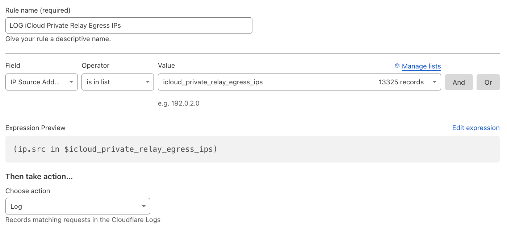

# iCloud Private Relay IP List Manager

This Cloudflare Worker `icloud-private-relay-ip-list-manager` periodically fetches lists from the [iCloud Private Relay egress IP addresses](https://github.com/hroost/icloud-private-relay-iplist) and updates an [IP list](https://developers.cloudflare.com/waf/tools/lists/custom-lists/#ip-lists) called `icloud_private_relay_egress_ips` on your Cloudflare account.

Individual IP addresses and CIDR ranges must be from `/8` to `/32` for IPv4 and from `/12` to `/64` for IPv6.

The main purpose of this project is to allow Cloudflare customers to create [WAF Custom Rules](https://developers.cloudflare.com/waf/custom-rules/) with this IP List to decide what to do with iCloud Private Relay requests.

Example:



## Features

- **Fetches** IPv4 and IPv6 addresses from a remote source.
- **Creates or updates** a Cloudflare IP List using Cloudflare's API.
- **Handles cron jobs** to fetch and update the list every 14 days (bi-weekly).
- **Supports dry-run mode** for testing without modifying the Cloudflare list.
- **Cursor-safe pagination** to reliably fetch all items from large lists.

## Cron Trigger

This worker is scheduled to run **every 14 days** at midnight UTC. The cron expression used is:

```plaintext
0 0 */14 * *
```

This means the worker will trigger at midnight UTC every 14th day starting from the 1st day of the month.

For more information on how Cloudflare Workers' cron triggers work, see [Cloudflare Workers Cron Trigger documentation](https://developers.cloudflare.com/workers/configuration/cron-triggers/).

## API Token Permissions

The Worker requires an API token with the following permission:

```plaintext
Account Filter Lists Edit
```

For more information on managing API Tokens in Cloudflare, refer to the [Cloudflare API Tokens documentation](https://developers.cloudflare.com/fundamentals/api/reference/permissions/#account-permissions). Review the [API documentation](https://developers.cloudflare.com/api/resources/rules/subresources/lists/subresources/items/methods/create/).

---

# Setup

[](https://deploy.workers.cloudflare.com/?url=https://github.com/DavidJKTofan/cf-icloud-private-relay-ip-list-manager)

1. **Clone the repository:**

   ```bash
   git clone https://github.com/DavidJKTofan/cf-icloud-private-relay-ip-list-manager.git
   cd cf-icloud-private-relay-ip-list-manager
   ```

2. **Install dependencies:**

   ```bash
   npm install
   ```

3. **Configure environment variables, preferably using Wrangler Secrets:**

   - `ACCOUNT_ID`: Your Cloudflare account ID.
   - `API_TOKEN`: The API token with appropriate permissions.
   - `LIST_NAME`: The name of the Cloudflare IP list.
   - `IPV4_LIST_SOURCE_URL`: The URL from which to fetch the IPv4s.
   - `IPV6_LIST_SOURCE_URL`: The URL from which to fetch the IPv6s.
   - `DRY_RUN` _(optional)_: Set to `true` to run in dry-run mode (console-only, no writes).

> For security purposes, it's best to store sensitive variables (such as your API token) using [Wrangler Secrets](https://developers.cloudflare.com/workers/configuration/secrets/).

> Note that you have a [soft-limit](https://developers.cloudflare.com/waf/tools/lists/#availability) of list items across all custom lists in your account. The Worker now supports fetching more items safely, but consider list limits when creating WAF rules.

4. **Deploy the Worker:**
   ```bash
   wrangler publish
   ```

## Testing Locally

To test the cron trigger locally:

1. Run the worker in development mode:

   ```bash
   npx wrangler dev --test-scheduled
   ```

2. Trigger the scheduled task manually by running:

   ```bash
   curl "http://localhost:8787/__scheduled?cron=0+0+*/14+*+*"
   ```

3. To test **dry-run mode**, set `DRY_RUN=true` in your environment; the Worker will log intended changes without modifying the Cloudflare IP list.

---

# Credits & Disclaimer

This repository is designed to help Cloudflare customers easily create their own "Managed" IP List, enabling them to take control over how they handle [iCloud Private Relay](https://support.apple.com/en-us/102602) requests/users on their websites proxied through Cloudflare.

The project is intended for **educational purposes only** and is not endorsed or officially supported by Apple or Cloudflare.

Special thanks to [hroost](https://github.com/hroost/icloud-private-relay-iplist) for providing the IP ranges in a convenient format. The data is sourced from the [original Apple IP feed](https://mask-api.icloud.com/egress-ip-ranges.csv).
